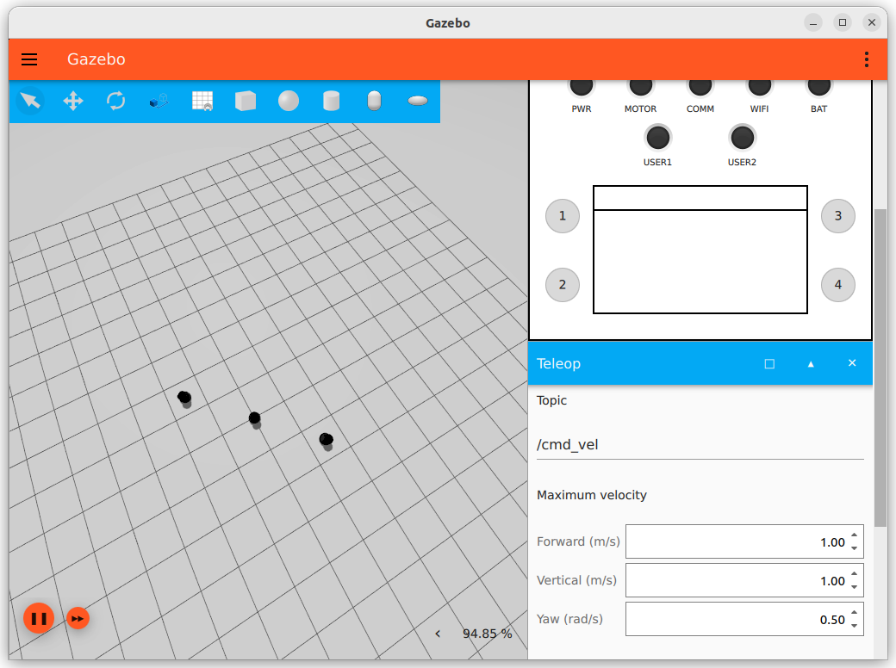

# TurtleBot Line-Formation Simulation Setup

This guide provides step-by-step instructions to set up and drive multiple TurtleBots in a simulated environment using ROS 2 and Ignition Gazebo. The process includes environment setup, launching the simulation, bridging topics between Ignition and ROS 2, and controlling the TurtleBots.

## A. Environment Setup

1. **Open 8 Terminal Windows**  
   You will need to open 8 terminal windows for this setup, as each terminal will be used to control different aspects of the simulation.

2. **Build and Source the ROS 2 Workspace**
   Before proceeding, you'll need to clone the tf_custom repository into your ROS 2 workspace (ros2_ws). This package contains the necessary nodes for controlling the TurtleBots.

   Clone the `tf_custom` Repository
   
   Open a terminal and navigate to your ROS 2 workspace (`ros2_ws`):

   ```bash
   cd ~/ros2_ws/src
   git clone https://github.com/minsol21/tf_custom.git
   ```
   
   This will download the `tf_custom` package into the `src` directory of your workspace.


   After cloning the repository, build and source your workspace to compile the newly added package.
   For each terminal, run the following commands to build and source your ROS 2 workspace:

   ```bash
   cd ~/ros2_ws
   colcon build
   source install/setup.bash
   ```
   

   ```bash
   cd ~/ros2_ws
   colcon build
   source install/setup.bash
   ```

## B. Simulation Setup

### 1. Launch TurtleBot Simulation with Namespaces

To simulate multiple TurtleBots, we will launch them in separate namespaces. This allows each TurtleBot to operate independently in the same simulation environment.

- **Launch TurtleBot 1 (tb1)**

   ```bash
   ros2 launch turtlebot4_ignition_bringup turtlebot4_ignition.launch.py namespace:=tb1 world:=empty
   ```

- **Launch TurtleBot 2 (tb2)**

   ```bash
   ros2 launch turtlebot4_ignition_bringup turtlebot4_spawn.launch.py namespace:=tb2 x:=1
   ```

- **Launch TurtleBot 3 (tb3)**

   ```bash
   ros2 launch turtlebot4_ignition_bringup turtlebot4_spawn.launch.py namespace:=tb3 x:=2
   ```

- **Launch Additional TurtleBot (tb4)**  
   For any additional TurtleBots, adjust the namespace and `x` coordinate:

   ```bash
   ros2 launch turtlebot4_ignition_bringup turtlebot4_spawn.launch.py namespace:=tb4 x:=3
   ```

### 2. Set Up Ignition Topic Bridge

The Ignition topic bridge allows ROS 2 and Ignition Gazebo to communicate by bridging topics between them. 

1. **List Available Ignition Topics**  
   Run the following command to list available Ignition topics:

   ```bash
   ign topic -l 
   ```

2. **Bridge Pose Topics for Each TurtleBot**

   For each TurtleBot, run the corresponding command to bridge the `/pose` topic between Ignition and ROS 2:

   - **tb1:**

      ```bash
      ros2 run ros_gz_bridge parameter_bridge /model/tb1/turtlebot4/pose@geometry_msgs/msg/Pose@gz.msgs.Pose
      ```

   - **tb2:**

      ```bash
      ros2 run ros_gz_bridge parameter_bridge /model/tb2/turtlebot4/pose@geometry_msgs/msg/Pose@gz.msgs.Pose
      ```

   - **tb3:**

      ```bash
      ros2 run ros_gz_bridge parameter_bridge /model/tb3/turtlebot4/pose@geometry_msgs/msg/Pose@gz.msgs.Pose
      ```

   - **Additional TurtleBot (tb4):**

      ```bash
      ros2 run ros_gz_bridge parameter_bridge /model/tb4/turtlebot4/pose@geometry_msgs/msg/Pose@gz.msgs.Pose
      ```

3. **Verify the Bridge**  
   After bridging the topics, check that they are successfully bridged by listing ROS 2 topics:

   ```bash
   ros2 topic list
   ```

   You should see topics like `/model/tb1/turtlebot4/pose`, `/model/tb2/turtlebot4/pose`, etc.

   To verify, echo the pose of one of the TurtleBots:

   ```bash
   ros2 topic echo /model/tb1/turtlebot4/pose
   ```

### 3. Drive TurtleBot

With the topics bridged, you can now control the TurtleBots. 

1. **Run the TurtleBot Mover Node**  
   Use the `turtlebotmover` node to position the TurtleBots along a line between two points. You can declare the boundary points as parameters via the command line:

   ```bash
   ros2 run tf_custom turtlebotmover --ros-args -p boundary_point1:="[ -2.0, -2.0 ]" -p boundary_point2:="[ 2.0, 2.0 ]"
   ```

   Another example:

   ```bash
   ros2 run tf_custom turtlebotmover --ros-args -p boundary_point1:="[ 0.0, -2.0 ]" -p boundary_point2:="[ 4.0, -2.0 ]"
   ```

   - `boundary_point1` and `boundary_point2` define the line along which the TurtleBots will be positioned.


**Node:** `turtlebotmover.py`

---

This version of the README is more structured, with added explanations and clarifications for each step. This should make it easier for users to follow the setup process and understand the commands they are executing.
## A. Environment Setup

open the default 8 terminal

for every terminal, `colcon build` and `source install`

```bash
cd ~/ros2_ws
colcon build
source install/setup.bash
```

## B. Simulation Setup

### 1. Namespace turtlebots

for each terminal, run those command.

tb1

```bash
ros2 launch turtlebot4_ignition_bringup turtlebot4_ignition.launch.py namespace:=tb1 world:=empty
```

tb2

```bash
ros2 launch turtlebot4_ignition_bringup turtlebot4_spawn.launch.py namespace:=tb2 x:=1
```

tb3

```bash
ros2 launch turtlebot4_ignition_bringup turtlebot4_spawn.launch.py namespace:=tb3 x:=2
```

for additional turtlebot, 

```bash
ros2 launch turtlebot4_ignition_bringup turtlebot4_spawn.launch.py namespace:=tb4 x:=3
```

### 2. Ignition topic bridge

```bash
ign topic -l 
```


**tb1**

```bash
ros2 run ros_gz_bridge parameter_bridge /model/tb1/turtlebot4/pose@geometry_msgs/msg/Pose@gz.msgs.Pose
```

**tb2**

```bash
ros2 run ros_gz_bridge parameter_bridge /model/tb2/turtlebot4/pose@geometry_msgs/msg/Pose@gz.msgs.Pose

```

**tb3**

```bash
ros2 run ros_gz_bridge parameter_bridge /model/tb3/turtlebot4/pose@geometry_msgs/msg/Pose@gz.msgs.Pose
```

for additional turtlebot, 

```bash
ros2 run ros_gz_bridge parameter_bridge /model/tb4/turtlebot4/pose@geometry_msgs/msg/Pose@gz.msgs.Pose

```

now, check with `ros2 topic list` if it’s bridged well

```bash
ros2 topic list
```

then you’ll find these 4 pose topics in ros2 now.

`/model/tb1/turtlebot4/pose`

`/model/tb2/turtlebot4/pose`

`/model/tb3/turtlebot4/pose`


check with `ros2 topic echo`

```jsx
ros2 topic echo /model/tb1/turtlebot4/pose
```


### 3. Drive Turtlebot


Now, using these topics, we can drive turtlebot with the node `turtlebotmover` 

we can position our turtlebots along the line evenly between two points

we can declare parameters with the command line

```bash
cd ~/ros2_ws
colcon build
source install/setup.bash
ros2 run tf_custom turtlebotmover --ros-args -p boundary_point1:="[ -2.0, -2.0 ]" -p boundary_point2:="[ 2.0, 2.0 ]"
```

```bash
ros2 run tf_custom turtlebotmover --ros-args -p boundary_point1:="[0.0, -2.0 ]" -p boundary_point2:="[ 4.0, -2.0 ]"
```




**node : turtlebotmover.py**

```python
import rclpy
from rclpy.node import Node
from geometry_msgs.msg import Twist
from geometry_msgs.msg import Pose
import math
import time

class TurtleBotMover(Node):
    def __init__(self, namespace):
        super().__init__('turtlebot_mover_' + namespace)

        # Declare parameters with default values
        self.declare_parameter('boundary_point1', (-3.0, -3.0))
        self.declare_parameter('boundary_point2', (3.0, 3.0))

        # Get parameters
        self.bpoint1 = self.get_parameter('boundary_point1').get_parameter_value().double_array_value
        self.bpoint2 = self.get_parameter('boundary_point2').get_parameter_value().double_array_value

        self.namespace = namespace
        self.publisher_ = self.create_publisher(Twist, f'/{namespace}/cmd_vel', 10)
        self.subscription = self.create_subscription(Pose, f'/model/{namespace}/turtlebot4/pose', self.pose_callback, 10)
        self.current_position = None
        self.current_orientation = None

    def pose_callback(self, msg: Pose):
        self.current_position = (msg.position.x, msg.position.y)
        self.current_orientation = (msg.orientation.x, msg.orientation.y, msg.orientation.z, msg.orientation.w)

    def move_to_goal(self, goal_x, goal_y):
        print(f"Moving {self.namespace} to goal position: ({goal_x}, {goal_y})")

        while self.current_position is None:
            rclpy.spin_once(self)

        start_time = time.time()
        while True:
            current_x, current_y = self.current_position
            distance = math.sqrt((goal_x - current_x) ** 2 + (goal_y - current_y) ** 2)

            if time.time() - start_time >= 1:
                print(f"{self.namespace} current position: ({current_x}, {current_y}), Distance to goal: {distance:.2f}")
                start_time = time.time()

            if distance < 0.1:
                print(f"{self.namespace} has reached the goal position.")
                break

            self.rotate_towards_goal(goal_x, goal_y)

            msg = Twist()
            msg.linear.x = 0.2
            self.publisher_.publish(msg)
            rclpy.spin_once(self)
            time.sleep(0.2)

        self.stop_robot()

    def rotate_towards_goal(self, goal_x, goal_y):
        while True:
            current_x, current_y = self.current_position
            angle_to_goal = math.atan2(goal_y - current_y, goal_x - current_x)
            yaw = self.get_yaw()
            angle_diff = self.normalize_angle(angle_to_goal - yaw)

            print(f"{self.namespace} current yaw: {yaw:.2f}, Angle to goal: {angle_to_goal:.2f}, Angle diff: {angle_diff:.2f}")

            if abs(angle_diff) < 0.05:
                print(f"{self.namespace} is aligned with the goal direction.")
                break

            msg = Twist()
            msg.angular.z = 0.2 if angle_diff > 0 else -0.2
            self.publisher_.publish(msg)
            rclpy.spin_once(self)

        self.stop_robot()

    def get_yaw(self):
        x, y, z, w = self.current_orientation
        siny_cosp = 2 * (w * z + x * y)
        cosy_cosp = 1 - 2 * (y * y + z * z)
        return math.atan2(siny_cosp, cosy_cosp)

    def normalize_angle(self, angle):
        while angle > math.pi:
            angle -= 2 * math.pi
        while angle < -math.pi:
            angle += 2 * math.pi
        return angle

    def stop_robot(self):
        msg = Twist()
        msg.linear.x = 0.0
        msg.angular.z = 0.0
        self.publisher_.publish(msg)
        self.get_logger().info(f'{self.namespace} stopping the robot.')

def calculate_goal_positions(bpoint1, bpoint2, num_robots):
    x1, y1 = bpoint1
    x2, y2 = bpoint2
    distance_x = x2 - x1
    distance_y = y2 - y1
    interval_x = distance_x / (num_robots + 1)
    interval_y = distance_y / (num_robots + 1)

    # Calculate evenly spaced positions
    goals = []
    for i in range(num_robots):
        # Interpolate positions
        goal_x = x1 + (i + 1) * interval_x
        goal_y = y1 + (i + 1) * interval_y
        goals.append((goal_x, goal_y))

    return goals

def main(args=None):
    rclpy.init(args=args)

    namespaces = ['tb1', 'tb2', 'tb3']
    num_robots = len(namespaces)

    # Create nodes to get parameters
    nodes = []
    for ns in namespaces:
        node = TurtleBotMover(ns)
        nodes.append(node)

    # Fetch boundary points from the first node
    bpoint1 = nodes[0].bpoint1
    bpoint2 = nodes[0].bpoint2

    # Calculate goal positions for each robot
    goal_positions = calculate_goal_positions(bpoint1, bpoint2, num_robots)

    # Move robots to their respective goals
    movers = []
    for ns, goal in zip(namespaces, goal_positions):
        mover = TurtleBotMover(ns)
        movers.append(mover)
        mover.move_to_goal(*goal)

    for mover in movers:
        mover.destroy_node()

    for node in nodes:
        node.destroy_node()

    rclpy.shutdown()

if __name__ == '__main__':
    main()

```
